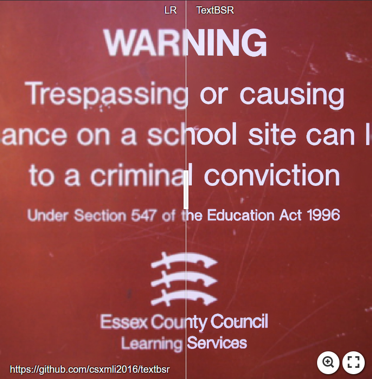
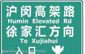

# This is a simple text image super-resolution package.
[](https://pypi.org/project/textbsr/)
[](https://github.com/csxmli2016/textbsr/blob/main/README.md#bookmark_tabs-citation)


[](https://imgsli.com/MTg0MDI4)
[](https://imgsli.com/MTg0MjIz)

This package can post-process the text region with a simple command, i.e., 
```
textbsr -i [LR_TEXT_PATH] -b [BACKGROUND_SR_PATH]
```

> - [LR_TEXT_PATH] is the LR image path.
> - [BACKGROUND_SR_PATH] stores the results from any blind image super-resolution methods.
> - If the text image is degraded severely, this method may still fail to obtain a plausible result.

### Dependencies and Installation
- numpy
- torch>=1.8.1
- torchvision>=0.9
- cnstd==1.2

``` 
# Install with pip
pip install textbsr
```


### Basic Usage

```
# On the terminal command
textbsr -i [LR_TEXT_PATH]
```
or
```
# On the python environment
from textbsr import textbsr
textbsr.bsr(input_path='./testsets/LQs')
```

Parameter details:

| parameter name | default | description  |
| :-----  | :-----:  | :-----  |
| -i, --input_path |  | The LR text image path. It can be full images or text layouts only. |
| -b, --bg_path | None | The background SR path from any BSR methods (e.g., [BSRGAN](https://github.com/cszn/BSRGAN), [Real-ESRGAN](https://github.com/xinntao/Real-ESRGAN), [StableSR](https://github.com/IceClear/StableSR)). If None, we only restore the text region detected by [cnstd](https://github.com/breezedeus/CnSTD).|
| -o, --output_path | None | The save path for text sr result. If None, we save the results on the same path with the format of [input_path]\_TIMESTAMP.|
| -a, --aligned | False | action='store_true'. If True, the input text image contains only **one-line** text region. If False, we use [cnstd](https://github.com/breezedeus/CnSTD) to detect text regions and then restore them.|
| -s, --save_text | False | action='store_true'. If True, save the LR and SR text layout.|
| -d, --device | None | Device, use 'gpu' or 'cpu'. If None, we use torch.cuda.is_available to select the device. |

---

## (1) Text Region Restoration
```
# On the terminal command
textbsr -i [LR_TEXT_PATH]
```
or
```
# On the python environment
from textbsr import textbsr
textbsr.bsr(input_path='./testsets/LQs', save_text=True)
```

[](https://imgsli.com/MTg0MDU1)
[](https://imgsli.com/MTg0MDIy)
[](https://imgsli.com/MTg0MDIz)
[](https://imgsli.com/MTg0MDQ4)


## (2) Post-process the Text Region from Any Blind Image Super-resolution (BSR) Methods


```
# On the terminal command
textbsr -i [LR_TEXT_PATH] -b [AnyBSR_Results_PATH] -s
```

or
```
# On the python environment
from textbsr import textbsr
textbsr.bsr(input_path='./testsets/LQs', bg_path='./testsets/AnyBSRResults', save_text=True)
```
> When [AnyBSR_Results_PATH] is None, we only restore the text region and paste it back to the LR input, with the background region unchanged.


| Real-world LR Text Image | AnyBSR Method | Post-process using our textbsr | 
| :-----:  | :-----:  | :-----:  |
| | | |
| | | |
| | | |

[](https://imgsli.com/MTg0MDMz)
[](https://imgsli.com/MTg0MjIz)

---

## (3) Example for restoring the aligned text region
```
# On the terminal command
textbsr -i [LR_TEXT_PATH] -a
```
or
```
# On the python environment
from textbsr import textbsr
textbsr.bsr(input_path='./testsets/LQs', aligned=True)
```


| Aligned LR Text Image | TextBSR |
| :-----:  | :-----:  |
|  |  |
|  |  |


## Acknowledgement
This project is built based on [BSRGAN](https://github.com/cszn/BSRGAN). We use [cnstd](https://github.com/breezedeus/CnSTD) for Chinese and English text detection.

## :bookmark_tabs: Citation
If you find this package helpful, please kindly consider citing our paper:
```
@InProceedings{li2023marconet,
author = {Li, Xiaoming and Zuo, Wangmeng and Loy, Chen Change},
title = {Learning Generative Structure Prior for Blind Text Image Super-resolution},
booktitle = {Proceedings of the IEEE/CVF Conference on Computer Vision and Pattern Recognition},
year = {2023}
}
```

## :scroll: License

This work is licensed under a <a rel="license" href="http://creativecommons.org/licenses/by-nc-sa/4.0/">Creative Commons Attribution-NonCommercial-ShareAlike 4.0 International License</a>.

<a rel="license" href="http://creativecommons.org/licenses/by-nc-sa/4.0/"></a>
